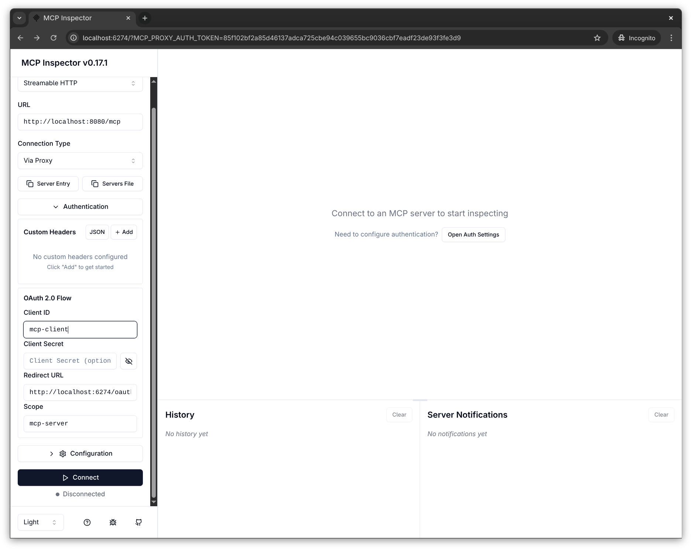
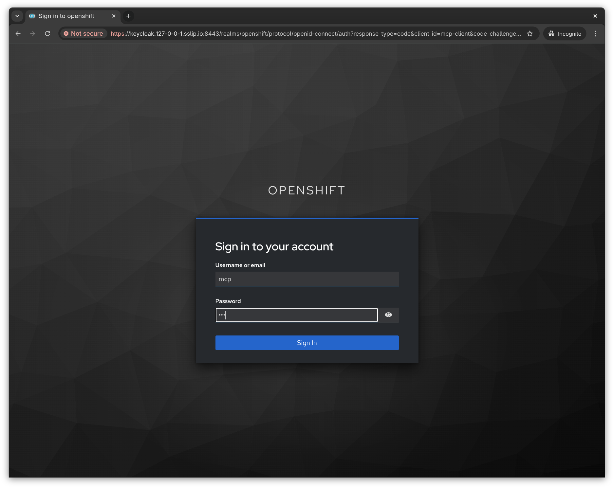
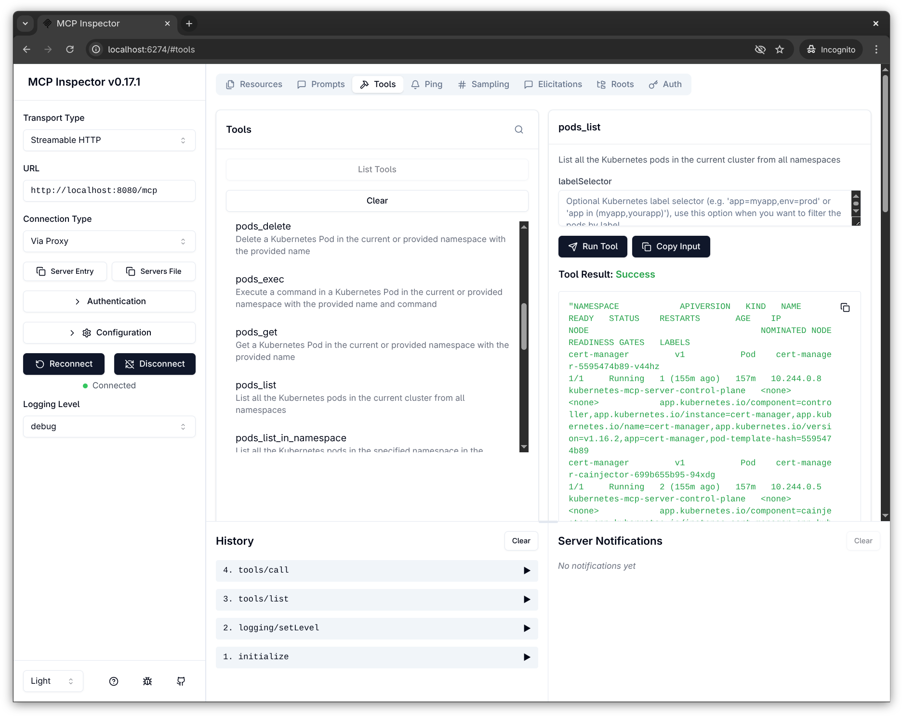

# Keycloak OIDC Setup for Kubernetes MCP Server

> **Warning: Preview Feature**
>
> OIDC/OAuth authentication setup is currently in **preview**. Configuration flags or fields may change. Use for **development and testing only**.

This guide shows you how to set up a local development environment with Keycloak for OIDC authentication testing.

## Overview

The local development environment includes:
- **Minikube cluster** with OIDC-enabled API server
- **Keycloak** (deployed in the cluster) for OIDC provider
- **Kubernetes MCP Server** configured for OAuth/OIDC authentication

## Quick Start

Set up the complete environment with one command:

```bash
make local-env-setup
```

This will:
1. Install required tools (minikube) to `./_output/tools/bin/`
2. Create a Minikube cluster with OIDC configuration
3. Deploy Keycloak in the cluster
4. Configure Keycloak realm and clients
5. Build the MCP server binary
6. Generate a configuration file at `_output/config.toml`
7. Add a managed `keycloak.keycloak.svc` entry to `/etc/hosts`

## Running the MCP Server

After setup completes, start the Keycloak port-forward and MCP server in separate terminals:

```bash
# Keep this port-forward running in a separate terminal, or in a background job
make keycloak-port-forward

# In another terminal, start the server
./kubernetes-mcp-server --config _output/config.toml
```

To test the HTTP OAuth flow, start MCP Inspector in a third terminal. The custom
CA allows Inspector's Node.js backend to fetch Keycloak metadata through the
local port-forward.

```bash
NODE_EXTRA_CA_CERTS="$(pwd)/_output/cert-manager-ca/ca.crt" \
  npx @modelcontextprotocol/inspector@latest
```

## Quick Walkthrough

### 1. Start MCP Inspector and Connect

After running Inspector, configure the connection as follows:

- Transport: **Streamable HTTP**
- URL: `http://localhost:8008/mcp`
- OAuth Client ID: `mcp-client`
- OAuth Client Secret: leave empty because `mcp-client` is a public client
- OAuth Scopes: `openid mcp-server`
- **Request refresh token**: disabled

The local `mcp-client` does not allow the `offline_access` scope that Inspector
adds when requesting refresh tokens. Click **Connect** after disabling that option.

<a href="images/keycloak-mcp-inspector-connect.png">
  
</a>

### 2. Login to Keycloak

You'll be redirected to Keycloak. Enter the test credentials:
- Username: `mcp`
- Password: `mcp`

<a href="images/keycloak-login-page.png">
  
</a>

### 3. Use MCP Tools

After authentication, you can use the **Tools** from the Kubernetes-MCP-Server from the MCP Inspector, like below where we run the `pods_list` tool, to list all pods in the current cluster from all namespaces.

<a href="images/keycloak-mcp-inspector-results.png">
  
</a>

## Architecture

### Keycloak Deployment
- Runs as a Deployment in the `keycloak` namespace
- Terminates TLS natively using a cert-manager certificate for `keycloak.keycloak.svc`
- Accessible in-cluster at `https://keycloak.keycloak.svc:8443`
- For browser access, use `make keycloak-port-forward` then open `https://keycloak.keycloak.svc:8443`

### Minikube Cluster with OIDC
- Kubernetes API server configured with OIDC authentication
- Points to Keycloak's `openshift` realm as the OIDC issuer
- Validates bearer tokens against Keycloak's JWKS endpoint
- API server trusts the cert-manager CA certificate

### Authentication Flow

```
User Browser
    |
    | 1. OAuth login (via port-forward to Keycloak)
    v
Keycloak (https://keycloak.keycloak.svc)
    |
    | 2. ID Token (aud: mcp-server)
    v
MCP Server
    |
    | 3. Token Exchange (aud: openshift)
    v
Keycloak
    |
    | 4. Exchanged Access Token
    v
MCP Server
    |
    | 5. Bearer Token in API request
    v
Kubernetes API Server
    |
    | 6. Validate token via OIDC
    v
Keycloak JWKS
    |
    | 7. Token valid, execute tool
    v
MCP Server -> User
```

## Keycloak Configuration

The setup automatically configures:

### Realm: `openshift`
- Token lifespan: 30 minutes
- Session idle timeout: 30 minutes

### Clients

1. **mcp-client** (public)
   - Public client for browser-based OAuth login
   - PKCE required for security
   - Valid redirect URIs: `*`

2. **mcp-server** (confidential)
   - Confidential client with client secret
   - Standard token exchange enabled
   - Can exchange tokens with `aud: openshift`
   - Default scopes: `openid`, `groups`, `mcp-server`
   - Optional scopes: `mcp:openshift`

3. **openshift** (confidential)
   - Target client for token exchange
   - Accepts exchanged tokens from `mcp-server`
   - Used by Kubernetes API server for OIDC validation

### Client Scopes
- **mcp-server**: Default scope with audience mapper
- **mcp:openshift**: Optional scope for token exchange with audience mapper
- **groups**: Group membership mapper (included in tokens)

### Default User
- **Username**: `mcp`
- **Password**: `mcp`
- **Email**: `mcp@example.com`
- **RBAC**: `cluster-admin` (full cluster access)

## MCP Server Configuration

The generated `_output/config.toml` includes:

```toml
require_oauth = true
oauth_audience = "mcp-server"
oauth_scopes = ["openid", "mcp-server"]
authorization_url = "https://keycloak.keycloak.svc:8443/realms/openshift"
certificate_authority = "_output/cert-manager-ca/ca.crt"  # For HTTPS validation

[token_exchange]
strategy = "rfc8693"
audience = "openshift"
scopes = ["mcp:openshift"]

[token_exchange.client_auth]
method = "client_secret_basic"
client_id = "mcp-server"
client_secret = "..."  # Auto-generated
```

## Useful Commands

### Check Keycloak Status

```bash
make keycloak-status
```

Shows:
- Keycloak pod status
- Service endpoints
- Access URL
- Admin credentials

### View Keycloak Logs

```bash
make keycloak-logs
```

### Access Keycloak Admin Console

Start a port-forward and open your browser:
```bash
make keycloak-port-forward
# Then open https://keycloak.keycloak.svc:8443
```

**Admin credentials:**
- Username: `admin`
- Password: `admin`

Navigate to the `openshift` realm to view/modify the configuration.

## Teardown

Remove the local environment:

```bash
make local-env-teardown
```

This deletes the Minikube cluster (Keycloak is removed with it) and removes the
`/etc/hosts` entry created by `make local-env-setup`. Existing user-managed
entries are left unchanged.
