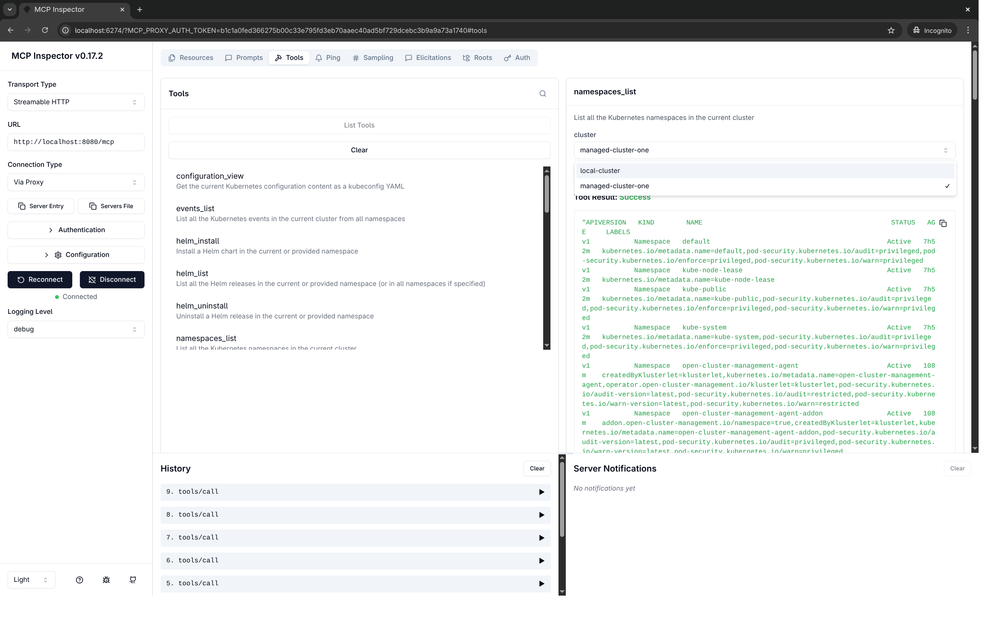

# Advanced Cluster Management (ACM) Setup

This guide shows you how to set up Red Hat Advanced Cluster Management (ACM) and use the OpenShift MCP Server with multiple OpenShift clusters.

## Overview

Advanced Cluster Management (ACM) allows you to manage multiple OpenShift clusters from a single hub cluster. The OpenShift MCP Server allows interaction with all your managed clusters through a single MCP server instance.

## Step 1: Install ACM on Hub Cluster

The hub cluster is the central OpenShift cluster that manages other clusters (managed clusters). You need to install ACM on the dedicated hub cluster first.

### Complete Installation

Install all ACM components with a single command:

```bash
make acm-install
```

This installs:
1. MultiCluster Engine (MCE)
2. ACM Operator
3. ACM Instance (MultiClusterHub CR)

### Verify Installation

Check ACM installation status:

```bash
make acm-status
```

Expected output:
```
==========================================
ACM Installation Status
==========================================

Namespaces:
multicluster-engine   Active   5m
open-cluster-management   Active   5m

Operators:
NAME                                 DISPLAY                              VERSION   REPLACES   PHASE
advanced-cluster-management.v2.14.0  Advanced Cluster Management         2.14.0               Succeeded

MultiClusterHub:
NAME               STATUS    AGE
multiclusterhub    Running   5m

ManagedClusters:
NAME           HUB ACCEPTED   MANAGED CLUSTER URLS   JOINED   AVAILABLE   AGE
local-cluster  true           https://...            True     True        5m
```

## Step 2: Import Managed Clusters

Once ACM is installed on your hub cluster, you can import additional OpenShift clusters.

### Import a Cluster

```bash
make acm-import-cluster \
  CLUSTER_NAME=production-east \
  MANAGED_KUBECONFIG=/path/to/production-east-kubeconfig
```

**Parameters**:
- `CLUSTER_NAME`: Unique name for the managed cluster
- `MANAGED_KUBECONFIG`: Path to the kubeconfig file for the managed cluster

### What Happens During Import

1. Creates `ManagedCluster` resource on hub
2. Generates import manifests (CRDs + import YAML)
3. Applies manifests to managed cluster
4. Installs klusterlet agent on managed cluster
5. Waits for cluster to become available

### Verify Import

```bash
oc get managedclusters
```

Expected output:
```
NAME               HUB ACCEPTED   MANAGED CLUSTER URLS                      JOINED   AVAILABLE   AGE
local-cluster      true           https://api.hub.example.com:6443         True     True        10m
production-east    true           https://api.prod-east.example.com:6443   True     True        5m
```

## Step 3: Run the MCP Server

Start the MCP Server with your ACM configuration

```toml
cluster_provider_strategy = "acm-kubeconfig"
kubeconfig = "/tmp/acm-hub-kubeconfig.yaml"

[cluster_provider_configs.acm-kubeconfig]
context_name = "acm-hub"
cluster_proxy_addon_ca_file = "./openshift-ca.crt"
```
Save this configuration as `acm-config.toml` and run the MCP Server:

```bash
./kubernetes-mcp-server --config acm-config.toml --port 8080
```

The MCP Server will:
1. Connect to the hub cluster using the kubeconfig
2. Discover all managed clusters via ACM
3. Provide tools to interact with all clusters

## Step 4: Test Multi-Cluster Access

With the MCP inspector you can test the access to the ACM-managed clusters. The MCP Server automatically discovers all ACM-managed clusters and on each tool you can select the one you want. Below is a screenshot of the `namespaces_list` tool:

<a href="images/mcp-inspector-acm-managed-cluster.png">
  
</a>
