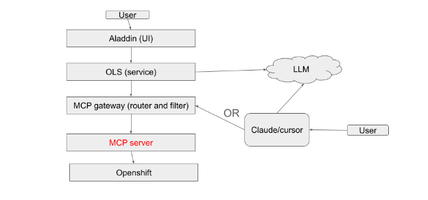

# MCP server for Red Hat OpenShift User Guide

## Features

The MCP server for Red Hat OpenShift supports several enterprise grade features

1. OAuth & OIDC integration for Token Exchange support with Keycloak
2. Modular Toolset Architecture with Read Only defaults
3. Full Observability stack with OpenTelemetry
4. Advanced Cluster Management integration & MCP gateway Integration

## Deployment and Architectural Guardrails

### Data Flow

#### OpenShift Lightspeed



## Toolsets and Functionality

By default the MCP server for Red Hat OpenShift enables only `core` and `config` tools in a read-only mode. In order to enable other available toolsets, like Kiali/OSSM or Kubevirt, those must be enabled in the `config.toml` file. In case of using `olm` or `kubevirt` toolsets there is a "config" section which needs to be updated, like:

```toml
toolsets = ["core", "olm", "kubevirt"]
```

### Core

#### Pods

| Tool                     | Description                                                                                         |
| :----------------------- | :-------------------------------------------------------------------------------------------------- |
| `pods_list`              | List all pods in the cluster from all namespaces with optional label and field selectors            |
| `pods_list_in_namespace` | List all pods in a specified namespace with optional label and field selectors                      |
| `pods_get`               | Get a specific pod by name in the current or provided namespace                                     |
| `pods_delete`            | Delete a pod by name in the current or provided namespace                                           |
| `pods_top`               | List resource consumption (CPU and memory) for pods via the Metrics Server                          |
| `pods_exec`              | Execute a command in a pod                                                                          |
| `pods_log`               | Get the logs of a pod with options for container selection, tail lines, and previous container logs |
| `pods_run`               | Run a pod in a specified namespace with a container image and optional name and port exposure       |

#### Generic Resources

| Tool                         | Description                                                                                    |
| :--------------------------- | :--------------------------------------------------------------------------------------------- |
| `resources_list`             | List Kubernetes resources by apiVersion and kind with optional namespace and selectors         |
| `resources_get`              | Get a specific resource by apiVersion, kind, name, and optional namespace                      |
| `resources_create_or_update` | Create or update a resource from a YAML or JSON representation (not enabled by default)        |
| `resources_delete`           | Delete a resource by apiVersion, kind, name, and optional namespace (not enabled by default)   |
| `resources_scale`            | Get or update the scale of a resource (e.g., Deployment, StatefulSet) (not enabled by default) |

#### Events

| Tool          | Description                                                                                |
| :------------ | :----------------------------------------------------------------------------------------- |
| `events_list` | List Kubernetes events (warnings, errors, state changes) for debugging and troubleshooting |

#### Namespaces

| Tool              | Description                                                         |
| :---------------- | :------------------------------------------------------------------ |
| `namespaces_list` | List all Kubernetes namespaces in the current cluster               |
| `projects_list`   | List all OpenShift projects in the current cluster (OpenShift-only) |

#### Nodes

| Tool                  | Description                                                                      |
| :-------------------- | :------------------------------------------------------------------------------- |
| `nodes_log`           | Get logs from a Kubernetes node through the API proxy to the kubelet             |
| `nodes_stats_summary` | Get detailed resource usage statistics from a node via the kubelet's Summary API |
| `nodes_top`           | List resource consumption (CPU and memory) for nodes via the Metrics Server      |

### Kiali

| Tool                           | Description                                                                                                                                                                                                  |
| :----------------------------- | :----------------------------------------------------------------------------------------------------------------------------------------------------------------------------------------------------------- |
| `kiali_mesh_graph`             | Returns the topology of specific namespaces, including health, status of the mesh, and a mesh health summary overview with aggregated counts of healthy, degraded, and failing apps, workloads, and services |
| `kiali_get_resource_details`   | Gets lists or detailed info for Kubernetes resources (services, workloads) within the service mesh                                                                                                           |
| `kiali_get_metrics`            | Gets metrics for a specific resource (service or workload) in a namespace, with configurable duration, step, rate interval, direction, reporter, and quantiles                                               |
| `kiali_get_traces`             | Gets distributed traces for a specific resource (app, service, or workload) in a namespace, or retrieves detailed information for a specific trace by its ID                                                 |
| `kiali_workload_logs`          | Gets logs for a specific workload's pods in a namespace, with automatic pod and container discovery and optional filtering by container name, time range, and line count                                     |
| `kiali_manage_istio_config`    | Creates, patches, or deletes Istio configuration objects (Gateways, VirtualServices, DestinationRules, etc.)                                                                                                 |
| `kiali_manage_istio_config_read` | Lists or gets Istio configuration objects (Gateways, VirtualServices, etc.) in a read-only manner                                                                                                          |

### Kubevirt

| Tool           | Description                                                                                                                                                                                                                                                    |
| :------------- | :------------------------------------------------------------------------------------------------------------------------------------------------------------------------------------------------------------------------------------------------------------- |
| `vm_create`    | Create a VirtualMachine in the cluster with the specified configuration, automatically resolving instance types, preferences, and container disk images. VM will be created in Halted state by default; use the `autostart` parameter to start it immediately. |
| `vm_lifecycle` | Manage VirtualMachine lifecycle: start, stop, or restart a VM.                                                                                                                                                                                                 |
| `vm_clone`     | Clone a KubeVirt VirtualMachine by creating a VirtualMachineClone resource. This creates a copy of the source VM with a new name using the KubeVirt Clone API.                                                                                                 |

### Netedge

| Tool                       | Description                                                                                                                                                                                                                                                                                                                                                                          |
| :------------------------- | :----------------------------------------------------------------------------------------------------------------------------------------------------------------------------------------------------------------------------------------------------------------------------------------------------------------------------------------------------------------------------------- |
| `netedge_query_prometheus` | Executes specialized diagnostic queries for specific NetEdge components. Accepts a `diagnostic_target` parameter: `ingress` (error rate, active connections, reloads, top error routes), `dns` (request rate, NXDOMAIN rate, SERVFAIL rate, panic recovery, error breakdown, rewrite count), or `operators` (active firing alerts and operator up status in ingress/DNS namespaces). |
| `get_coredns_config`       | Retrieves the current CoreDNS configuration (Corefile) from the cluster by reading the `dns-default` ConfigMap in the `openshift-dns` namespace.                                                                                                                                                                                                                                     |

### Observability

| Tool                     | Description                                                                                                                                                                                                   |
| :----------------------- | :------------------------------------------------------------------------------------------------------------------------------------------------------------------------------------------------------------ |
| `prometheus_query`       | Executes an instant PromQL query against the cluster's Thanos Querier, returning current metric values at a specified point in time (or the current time if not specified).                                   |
| `prometheus_query_range` | Executes a range PromQL query against the cluster's Thanos Querier, returning metric values over a time range with a specified resolution step, useful for time-series data, trends, and historical analysis. |
| `alertmanager_alerts`    | Queries active and pending alerts from the cluster's Alertmanager, with filtering support for active/silenced/inhibited states and Alertmanager filter syntax.                                                |

## Bring Your Own Model

### Accuracy

Large Language Models (LLM's) are probabilistic in nature, which are inherently different in testing than traditional, procedural programming.  While we've made every effort to thoroughly and reliably evaluate our MCP server against a variety of prompts that mimic real world scenarios.  Despite best efforts, this list may not be exhaustive, so please ensure you follow our recommendations around safety and best practices, data ownership, and security guardrails below (and note where there are any gaps/risks associated with your data flow).

### Verification & Evaluation Process

MCP server for Red Hat OpenShift uses [mcpchecker](https://github.com/mcpchecker/mcpchecker) for evaluations and verifies the tool we described is successfully called based on possible prompts via the Agent.

The following models have been evaluated on OCP 4.XX

| Provider | Model | Evaluation Results |
| :---- | :---- | :---- |
| OpenAI | gpt-5 | 17/24 |
| Anthropic | Claude 4.5 Sonnet | Not evaluated |
| Google | Gemini 3.1 Pro | 15/24 |
| IBM Watson.x | Granite | Not evaluated |

## Safety And Best Practices

### Required Verification Workflow

#### Human In The Loop (HITL) Enforcement

* It is recommended for users to assess the agent's proposed action in the MCP client.
* Users should manually check suggested resource versions (e.g., ensure the model isn't suggesting deprecated APIs)
* It is recommended that users use a human approval mechanism in the client interface for "write" actions.

#### Data Privacy & Redaction

The MCP server for Red Hat OpenShift has no internal mechanisms for PII and data redaction.  If you need to ensure any cluster information within allowed CR's (see Access Revocation Protocols for how to scope and limit MCP access to specific Cluster Resources), then leverage Trusty AI as an MCP gateway extension to do so.

#### Audit Trail Recommendation

The MCP server for Red Hat OpenShift is configured to append a user-agent string in audit logs to identify that requests were made via an Agent (through the MCP server).  Ensure that authorization is enabled via OAuth (Keycloak) or MCP gateway\[[config](https://docs.kuadrant.io/dev/mcp-gateway/docs/guides/authorization/)\].

#### Recommendations Regarding 3rd Party MCP servers

The MCP server for Red Hat OpenShift cannot speak to the efficacy, accuracy or utility to 3rd party MCP servers.  It is best practice to leverage Red Hat OpenShift AI to do so.

## Data Ownership

The MCP server for Red Hat OpenShift does not store any information or state of the cluster.  Should you opt-in, there are several telemetry metrics that are collected to understand the overall usage levels of the MCP server;

Cluster:k8s\_mcp\_tool\_calls:sum: Total count of all MCP tool invocations across the cluster
Cluster:k8s\_mcp\_tool\_errors:sum: Total count of all failed MCP tool invocations across the cluster
Cluster:k8s\_mcp\_http\_requests:sum: Total count of all HTTP requests received by the MCP server

These metrics do not collect specific details of the calls, requests are errors themselves, only providing aggregate overall sums of the usage.

## Security Guardrails / TrustAI

### MCP gateway Setup

[https://docs.kuadrant.io/1.4.x/mcp-gateway/docs/guides/register-mcp-servers/\#step-2-create-mcpserverregistration-resource](https://docs.kuadrant.io/1.4.x/mcp-gateway/docs/guides/register-mcp-servers/#step-2-create-mcpserverregistration-resource)

We recommend you route all traffic through the MCP gateway to take advantage of the security guardrails and authorization features that MCP gateway provides.  To do so, follow the guide\[[MCP gateway registration guide](https://docs.kuadrant.io/1.4.x/mcp-gateway/docs/guides/register-mcp-servers/#step-2-create-mcpserverregistration-resource)\] to registering the MCP server as a MCP server Registration Resource.

### RBAC Enforcement

The MCP server for Red Hat OpenShift can be configured to use a Service Account and RBAC.  By default, RBAC is enabled, and you can extend the ClusterRoles, ClusterRoleBindings, Roles and Rolebindings via their relevant 'extra' parameters here: [https://github.com/openshift/openshift-mcp-server/blob/main/charts/kubernetes-mcp-server/values.yaml\#L37](https://github.com/openshift/openshift-mcp-server/blob/main/charts/kubernetes-mcp-server/values.yaml#L37)

### Access Revocation Protocols

The MCP server for Red Hat OpenShift supports revoking access to CR level resources.  We highly recommend that you limit access to Secrets, ConfigMaps and RBAC (RoleBindings, ClusterRoles)

```toml
# Deny access to Secrets and ConfigMaps
[[denied_resources]]
group = ""
version = "v1"
kind = "Secret"

# Deny access to RBAC resources for additional security
[[denied_resources]]
group = "rbac.authorization.k8s.io"
version = "v1"
kind = "Role"

[[denied_resources]]
group = "rbac.authorization.k8s.io"
version = "v1"
kind = "RoleBinding"

[[denied_resources]]
group = "rbac.authorization.k8s.io"
version = "v1"
kind = "ClusterRole"

[[denied_resources]]
group = "rbac.authorization.k8s.io"
version = "v1"
kind = "ClusterRoleBinding"
```

In an emergency, one of several possible actions can be taken to revoke access for the LLM Agent (via the MCP server).

1. Remove access to the offending tool \[[Github Link](https://github.com/openshift/openshift-mcp-server/blob/main/docs/configuration.md#tool-filtering)\] in `config.toml`

```toml
# Only enable specific tools
enabled_tools = ["pods_list", "pods_get", "pods_log"]

# Or disable specific tools from enabled toolsets
disabled_tools = ["resources_delete", "pods_delete"]
```
2. Disable destructive tool calls \[[Github Link](https://github.com/openshift/openshift-mcp-server/blob/main/docs/configuration.md#access-control)\] in `config.toml`
```toml
# Production-safe configuration
read_only = true

# Or allow writes but prevent deletions
disable_destructive = true
```

2. Uninstall the MCP server completely
   `helm uninstall openshift-mcp-server`
3. Per User Revocation with RBAC revocation
   Get rid of the user's rolebinding/clusterrolebinding \[[OpenShift RBAC API docs](https://docs.redhat.com/en/documentation/openshift_container_platform/4.21/html/rbac_apis/rbac-apis)\]
4. Remove access through the MCP gateway

To remove access through the gateway, you can delete the MCPServerRegistration CR \[[Kuadrant MCP gateway guide](https://docs.kuadrant.io/1.4.x/mcp-gateway/docs/guides/register-mcp-servers/#step-2-create-mcpserverregistration-resource)\]. `oc delete mcpsr <name of registration>`

## Troubleshooting & Support

### Technical Issues

File bugs in accordance with your support contact – [access.redhat.com](http://access.redhat.com)
Product: OpenShift Container Platform \- Component: MCP server for Red Hat OpenShift

### Feedback

[https://forms.gle/QZji8fcFMTaV8bv26](https://forms.gle/QZji8fcFMTaV8bv26)

## Additional Information

For additional information, please see the upstream documentation via:
[https://github.com/containers/kubernetes-mcp-server](https://github.com/containers/kubernetes-mcp-server)
[https://github.com/openshift/openshift-mcp-server](https://github.com/openshift/openshift-mcp-server)
