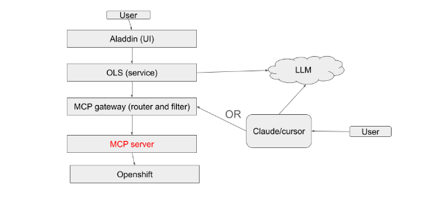

# MCP server for Red Hat OpenShift User Guide

**Note**: the MCP server for Red Hat OpenShift is in Developer Preview. A Developer Preview in the context of Red Hat products indicates that the product is in a pre-release stage, intended for developers and early adopters to test and provide feedback. It's not recommended for production use due to potential limitations and instability.

## Features

The MCP server for Red Hat OpenShift includes several enterprise grade features

1. OAuth & OIDC integration for Token Exchange support with Keycloak
2. Modular Toolset Architecture with Read Only defaults
3. Full Observability stack with OpenTelemetry
4. Advanced Cluster Management integration & MCP gateway Integration

## Deployment and Architectural Guardrails

### Data Flow

#### OpenShift Lightspeed



## Toolsets and Functionality

By default the MCP server for Red Hat OpenShift enables only `core` and `config` tools in a read-only mode. In order to enable other available toolsets, like Kiali/OSSM or Kubevirt, those must be enabled in the `config.toml` file. In case of using `ossm` or `kubevirt` toolsets there is a "config" section which needs to be updated, like:

```toml
toolsets = ["core", "ossm", "kubevirt"]
```

### Core

#### Pods

| Tool                     | Description                                                                                         |
| :----------------------- | :-------------------------------------------------------------------------------------------------- |
| `pods_list`              | List all pods in the cluster from all namespaces with optional label and field selectors            |
| `pods_list_in_namespace` | List all pods in a specified namespace with optional label and field selectors                      |
| `pods_get`               | Get a specific pod by name in the current or provided namespace                                     |
| `pods_delete`            | Delete a pod by name in the current or provided namespace                                           |
| `pods_top`               | List resource consumption (CPU and memory) for pods via the Metrics Server                          |
| `pods_exec`              | Execute a command in a pod                                                                          |
| `pods_log`               | Get the logs of a pod with options for container selection, tail lines, and previous container logs |
| `pods_run`               | Run a pod in a specified namespace with a container image and optional name and port exposure       |

#### Generic Resources

| Tool                         | Description                                                                                    |
| :--------------------------- | :--------------------------------------------------------------------------------------------- |
| `resources_list`             | List Kubernetes resources by apiVersion and kind with optional namespace and selectors         |
| `resources_get`              | Get a specific resource by apiVersion, kind, name, and optional namespace                      |
| `resources_create_or_update` | Create or update a resource from a YAML or JSON representation (not enabled by default)        |
| `resources_delete`           | Delete a resource by apiVersion, kind, name, and optional namespace (not enabled by default)   |
| `resources_scale`            | Get or update the scale of a resource (e.g., Deployment, StatefulSet) (not enabled by default) |

#### Events

| Tool          | Description                                                                                |
| :------------ | :----------------------------------------------------------------------------------------- |
| `events_list` | List Kubernetes events (warnings, errors, state changes) for debugging and troubleshooting |

#### Namespaces

| Tool              | Description                                                         |
| :---------------- | :------------------------------------------------------------------ |
| `namespaces_list` | List all Kubernetes namespaces in the current cluster               |
| `projects_list`   | List all OpenShift projects in the current cluster (OpenShift-only) |

#### Nodes

| Tool                  | Description                                                                      |
| :-------------------- | :------------------------------------------------------------------------------- |
| `nodes_log`           | Get logs from a Kubernetes node through the API proxy to the kubelet             |
| `nodes_stats_summary` | Get detailed resource usage statistics from a node via the kubelet's Summary API |
| `nodes_top`           | List resource consumption (CPU and memory) for nodes via the Metrics Server      |

### OpenShift Service Mesh (OSSM)

Tools for managing and diagnosing OpenShift Service Mesh (backed by Kiali). Enable via \`toolsets = ["core", "ossm"]\` and configure the \`[toolset_configs.kiali]\` section. See the [OSSM Documentation](../OSSM.md) for complete details.

| Tool                           | Description                                                                                                                                                                                                  |
| :----------------------------- | :----------------------------------------------------------------------------------------------------------------------------------------------------------------------------------------------------------- |
| `ossm_get_mesh_traffic_graph`  | Returns service-to-service traffic topology, dependencies, and network metrics (throughput, response time, mTLS) for specified namespaces.                                                                    |
| `ossm_get_mesh_status`         | Retrieves high-level health, topology, and environment details of the Istio service mesh.                                                                                                                    |
| `ossm_get_resource_details`   | Gets lists or detailed info for mesh resources (applications, workloads, services) within the service mesh.                                                                                                   |
| `ossm_get_metrics`            | Gets metrics for a specific resource (service or workload) in a namespace, with configurable duration, step, rate interval, direction, reporter, and quantiles.                                              |
| `ossm_list_traces`             | Lists distributed traces for a service in a namespace.                                                                                                                                                       |
| `ossm_get_trace_details`       | Fetches a single distributed trace by trace ID and returns its call hierarchy.                                                                                                                               |
| `ossm_get_pod_performance`     | Returns a human-readable summary comparing Pod CPU/memory usage to requests and limits.                                                                                                                      |
| `ossm_get_logs`                | Gets logs for a specific workload's pods in a namespace, with automatic pod and container discovery and optional filtering.                                                                                |
| `ossm_list_mesh_clusters`      | Returns the list of Istio mesh clusters accessible by Kiali/OSSM.                                                                                                                                            |
| `ossm_manage_istio_config`     | Creates, patches, or deletes Istio, Gateway API, and Inference API configuration objects (Gateways, VirtualServices, etc.).                                                                                  |
| `ossm_manage_istio_config_read`| Lists or gets Istio, Gateway API, and Inference API configuration objects in a read-only manner.                                                                                                              |

### Kubevirt

| Tool           | Description                                                                                                                                                                                                                                                    |
| :------------- | :------------------------------------------------------------------------------------------------------------------------------------------------------------------------------------------------------------------------------------------------------------- |
| `vm_create`    | Create a VirtualMachine in the cluster with the specified configuration, automatically resolving instance types, preferences, and container disk images. VM will be created in Halted state by default; use the `autostart` parameter to start it immediately. |
| `vm_lifecycle` | Manage VirtualMachine lifecycle: start, stop, or restart a VM.                                                                                                                                                                                                 |
| `vm_clone`     | Clone a KubeVirt VirtualMachine by creating a VirtualMachineClone resource. This creates a copy of the source VM with a new name using the KubeVirt Clone API.                                                                                                 |

### Netedge

Network Ingress and DNS troubleshooting tools. Enable via \`toolsets = ["core", "netedge"]\`. See the [NetEdge Documentation](NETEDGE.md) for full details.

| Tool                       | Description                                                                                                                                                                                                                                                                                                                                                                          |
| :------------------------- | :----------------------------------------------------------------------------------------------------------------------------------------------------------------------------------------------------------------------------------------------------------------------------------------------------------------------------------------------------------------------------------- |
| `netedge_query_prometheus` | Executes specialized diagnostic queries for specific NetEdge components (\`ingress\`, \`dns\`, or \`operators\`).                                                                                                                                                                                                                                                                    |
| `inspect_route`            | Inspects an OpenShift Route for configuration issues, TLS certificates, backend services, and ingress status.                                                                                                                                                                                                                                                                       |
| `get_router_config`        | Retrieves the HAProxy router configuration (haproxy.config) from an IngressController pod.                                                                                                                                                                                                                                                                                           |
| `get_router_info`          | Retrieves runtime info from HAProxy router pods (version, uptime, process statistics).                                                                                                                                                                                                                                                                                               |
| `get_router_sessions`      | Retrieves active session counts and connection statistics from HAProxy router pods.                                                                                                                                                                                                                                                                                                  |
| `get_coredns_config`       | Retrieves the current CoreDNS configuration (Corefile) from the cluster by reading the \`dns-default\` ConfigMap in the \`openshift-dns\` namespace.                                                                                                                                                                                                                                     |
| `get_service_endpoints`    | Retrieves endpoints and endpoint slices for a service to verify backend pod availability.                                                                                                                                                                                                                                                                                            |
| `exec_dns_in_pod`          | Executes DNS resolution commands inside an ephemeral debug pod on a specific node.                                                                                                                                                                                                                                                                                                   |
| `probe_dns_local`          | Performs DNS lookup from the local MCP server environment.                                                                                                                                                                                                                                                                                                                           |
| `probe_http`               | Performs HTTP/HTTPS requests to verify route and ingress endpoints.                                                                                                                                                                                                                                                                                                                   |

### Observability

Observability query tools are provided by [obs-mcp](https://github.com/rhobs/obs-mcp) toolsets. Enable them explicitly (for example `observability/metrics`). See the [metrics](../observability/metrics.md), [logs](../observability/logs.md), [tracing](../observability/tracing.md), and [otelcol](../observability/otelcol.md) guides for full details.

| Tool                     | Toolset                 | Description                                                                                                                                                                                                   |
| :----------------------- | :---------------------- | :------------------------------------------------------------------------------------------------------------------------------------------------------------------------------------------------------------ |
| `list_metrics`           | `observability/metrics` | Lists available metric names (regex filter). Call this before writing PromQL queries.                                                                                                                         |
| `execute_instant_query`  | `observability/metrics` | Executes a PromQL instant query against Prometheus/Thanos Querier, returning current metric values at a point in time.                                                                                        |
| `execute_range_query`    | `observability/metrics` | Executes a PromQL range query against Prometheus/Thanos Querier, returning time-series data over a window.                                                                                                    |
| `get_alerts`             | `observability/metrics` | Queries alerts from Alertmanager (requires `alertmanager_url`), with filtering for active/silenced/inhibited states.                                                                                          |
| `get_silences`           | `observability/metrics` | Queries silences from Alertmanager (requires `alertmanager_url`), with label matcher filtering.                                                                                                               |
| `loki_query_range`       | `observability/logs`    | Executes a Loki LogQL range query and returns matching log streams and lines.                                                                                                                                 |
| `tempo_search_traces`    | `observability/traces`  | Searches distributed traces in Tempo using TraceQL.                                                                                                                                                           |

### Additional OpenShift Toolsets

The downstream OpenShift distribution provides additional specialized toolsets:

- **OpenShift Core (`openshift`)**: OpenShift project management (`projects_list`, `project_get`, etc.) and the `plan_mustgather` diagnostic prompt. See the [OpenShift Documentation](../OPENSHIFT.md).
- **CNI Diagnostics & OVN-Kubernetes (`cni-diagnostics`, `ovn-kubernetes`)**: Comprehensive networking and OVN-Kubernetes troubleshooting tools. See the [CNI Diagnostics Guide](cni-diagnostics.md) and [OVN-Kubernetes Guide](ovn-kubernetes.md).
- **OpenShift API for Data Protection (`oadp`)**: Backup, restore, and snapshot management tools. See the [OADP Documentation](../OADP.md).
- **Advanced Cluster Management (`acm`)**: Multi-cluster management across OpenShift fleets. See the [ACM Support Guide](acm.md) and [ACM Setup Guide](acm_setup.md).

## Bring Your Own Model

### Accuracy

Large Language Models (LLM's) are probabilistic in nature, which are inherently different in testing than traditional, procedural programming.  While we've made every effort to thoroughly and reliably evaluate our MCP server against a variety of prompts that mimic real world scenarios.  Despite best efforts, this list may not be exhaustive, as the LLM/Agent calls the MCP server (not vice versa).  Please ensure you follow our recommendations around safety and best practices, data ownership, and security guardrails below (and note where there are any gaps/risks associated with your data flow).

### Verification & Evaluation Process

MCP server for Red Hat OpenShift uses [mcpchecker](https://github.com/mcpchecker/mcpchecker) for evaluations and verifies the tool we described is successfully called based on possible prompts via the Agent.

The following models have been evaluated on OCP 4.21

| Provider | Model | Evaluation Results |
| :---- | :---- | :---- |
| OpenAI | gpt-5 | 17/24 |
| Anthropic | Claude 4.5 Sonnet | Not evaluated |
| Google | Gemini 3.1 Pro | 15/24 |
| IBM Watson.x | Granite | Not evaluated |

## Safety And Best Practices

### Required Verification Workflow

#### Human In The Loop (HITL) Enforcement

* It is recommended for users to assess the agent's proposed action in the MCP client.
* Users should manually check suggested resource versions (e.g., ensure the model isn't suggesting deprecated APIs)
* It is recommended that users use a human approval mechanism in the client interface for "write" actions.

#### Data Privacy & Redaction

The MCP server for Red Hat OpenShift has no internal mechanisms for PII and data redaction.  If you need to ensure any cluster information within allowed CR's (see Access Revocation Protocols for how to scope and limit MCP access to specific Cluster Resources), then leverage Trusty AI as an MCP gateway extension to do so.

#### Audit Trail Recommendation

The MCP server for Red Hat OpenShift is configured to append a user-agent string in audit logs to identify that requests were made via an Agent (through the MCP server).  Ensure that authorization is enabled via OAuth (Keycloak) or MCP gateway\[[config](https://docs.kuadrant.io/dev/mcp-gateway/docs/guides/authorization/)\].

#### Recommendations Regarding 3rd Party MCP servers

For better security and control, it is recommended that third-party MCP hosts implement a Human-In-The-Loop (HITL) requirement to approve any "write" operations performed via the MCP server for Red Hat OpenShift.

## Data Ownership

The MCP server for Red Hat OpenShift does not store any information or state of the cluster.  Should you opt-in, there are several telemetry metrics that are collected to understand the overall usage levels of the MCP server;

Cluster:k8s\_mcp\_tool\_calls:sum: Total count of all MCP tool invocations across the cluster
Cluster:k8s\_mcp\_tool\_errors:sum: Total count of all failed MCP tool invocations across the cluster
Cluster:k8s\_mcp\_http\_requests:sum: Total count of all HTTP requests received by the MCP server

These metrics do not collect specific details of the calls, requests are errors themselves, only providing aggregate overall sums of the usage.

## Security Guardrails / TrustAI

### MCP gateway Setup

[https://docs.kuadrant.io/1.4.x/mcp-gateway/docs/guides/register-mcp-servers/\#step-2-create-mcpserverregistration-resource](https://docs.kuadrant.io/1.4.x/mcp-gateway/docs/guides/register-mcp-servers/#step-2-create-mcpserverregistration-resource)

We recommend you route all traffic through the MCP gateway to take advantage of the security guardrails and authorization features that MCP gateway provides.  To do so, follow the guide\[[MCP gateway registration guide](https://docs.kuadrant.io/1.4.x/mcp-gateway/docs/guides/register-mcp-servers/#step-2-create-mcpserverregistration-resource)\] to registering the MCP server as a MCP server Registration Resource.

### RBAC Enforcement

The MCP server for Red Hat OpenShift can be configured to use a Service Account and RBAC.  By default, RBAC is enabled, and you can extend the ClusterRoles, ClusterRoleBindings, Roles and Rolebindings via their relevant 'extra' parameters here: [https://github.com/openshift/openshift-mcp-server/blob/main/charts/kubernetes-mcp-server/values.yaml\#L37](https://github.com/openshift/openshift-mcp-server/blob/main/charts/kubernetes-mcp-server/values.yaml#L37)

### Access Revocation Protocols

The MCP server for Red Hat OpenShift supports revoking access to CR level resources.  We highly recommend that you limit access to Secrets, ConfigMaps and RBAC (RoleBindings, ClusterRoles)

```toml
# Deny access to Secrets and ConfigMaps
[[denied_resources]]
group = ""
version = "v1"
kind = "Secret"

# Deny access to RBAC resources for additional security
[[denied_resources]]
group = "rbac.authorization.k8s.io"
version = "v1"
kind = "Role"

[[denied_resources]]
group = "rbac.authorization.k8s.io"
version = "v1"
kind = "RoleBinding"

[[denied_resources]]
group = "rbac.authorization.k8s.io"
version = "v1"
kind = "ClusterRole"

[[denied_resources]]
group = "rbac.authorization.k8s.io"
version = "v1"
kind = "ClusterRoleBinding"
```

In an emergency, one of several possible actions can be taken to revoke access for the LLM Agent (via the MCP server).

1. Remove access to the offending tool \[[Github Link](https://github.com/openshift/openshift-mcp-server/blob/main/docs/configuration.md#tool-filtering)\] in `config.toml`

```toml
# Only enable specific tools
enabled_tools = ["pods_list", "pods_get", "pods_log"]

# Or disable specific tools from enabled toolsets
disabled_tools = ["resources_delete", "pods_delete"]
```
2. Disable destructive tool calls \[[Github Link](https://github.com/openshift/openshift-mcp-server/blob/main/docs/configuration.md#access-control)\] in `config.toml`
```toml
# Production-safe configuration
read_only = true

# Or allow writes but prevent deletions
disable_destructive = true
```

2. Uninstall the MCP server completely
   `helm uninstall openshift-mcp-server`
3. Per User Revocation with RBAC revocation
   Get rid of the user's rolebinding/clusterrolebinding \[[OpenShift RBAC API docs](https://docs.redhat.com/en/documentation/openshift_container_platform/4.21/html/rbac_apis/rbac-apis)\]
4. Remove access through the MCP gateway

To remove access through the gateway, you can delete the MCPServerRegistration CR \[[Kuadrant MCP gateway guide](https://docs.kuadrant.io/1.4.x/mcp-gateway/docs/guides/register-mcp-servers/#step-2-create-mcpserverregistration-resource)\]. `oc delete mcpsr <name of registration>`

## Troubleshooting & Support

### Technical Issues

File bugs in accordance with your support contact – [access.redhat.com](http://access.redhat.com)
Product: OpenShift Container Platform \- Component: MCP server for Red Hat OpenShift

### Feedback

[https://forms.gle/QZji8fcFMTaV8bv26](https://forms.gle/QZji8fcFMTaV8bv26)

## Additional Information

For additional information, please see the upstream documentation via:
[https://github.com/containers/kubernetes-mcp-server](https://github.com/containers/kubernetes-mcp-server)
[https://github.com/openshift/openshift-mcp-server](https://github.com/openshift/openshift-mcp-server)
