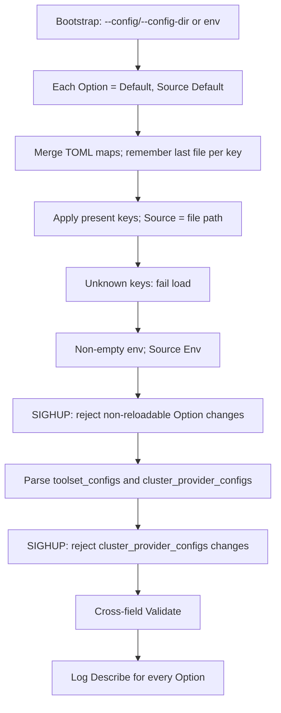

# Config Option Framework

Status: **Implemented**

This spec is the implemented configuration engine, originally sketched in
[containers/kubernetes-mcp-server#1374](https://github.com/containers/kubernetes-mcp-server/issues/1374).
There is no deprecation window and no compatibility shims.

Current user-facing behavior lives in [`docs/configuration.md`](../configuration.md).
Upgrade notes live in [`docs/configuration-changes.md`](../configuration-changes.md).

The [master table](#master-table) records which options have which vectors
(TOML / env) and how those are spelled. Empty TOML / Env / CLI cells mean
that vector is **not available**. CLI cells are empty for every runtime
option; the only flags are bootstrap (`--config`, `--config-dir`,
`--version`).

## Problem (previous surface)

Before this engine, config was defined and applied in several places:

- TOML + defaults in [`pkg/config`](../../pkg/config) (`StaticConfig`)
- CLI copies in [`pkg/kubernetes-mcp-server/cmd/root.go`](../../pkg/kubernetes-mcp-server/cmd/root.go)
  (`loadFlags`, only if cobra `Changed`)
- Getter-time `os.Getenv` for TLS and OTEL
- Direct `os.Getenv` bypasses (`KUBE_CLIENT_QPS`, debounce windows, …)

There was no provenance, SIGHUP did not re-apply CLI overrides, and help
text / docs / flags were duplicated by hand.

## Design

- Type is `Config` (renamed from `StaticConfig`; `ConfigState` from
  `StaticConfigState`).
- Runtime values live on `Config` as `Option[T]`. Callers use
  `cfg.Port.Get()`, `cfg.Port.Describe()`, `cfg.Port.Source()`.
- **Source is a string**, not an enum. See [Source](#source).
- **Vectors are data, not engine policy.** Each option opts into TOML /
  env by having a non-empty name for that vector. Empty = not available.
  There is no CLI vector on `Option`.
- **Precedence among enabled vectors is fixed:** default &lt; file (main,
  then lexical drop-ins) &lt; env. Empty env is unset (does not override).
- Straight cutover. The Change column documents breaks versus the previous
  surface. No deprecation aliases, no replacement env vars for dropped
  flags.
- Do **not** add env vars as stand-ins for dropped CLI. Those options are
  TOML (or default) only. Keep env names that already exist.
- **Unknown TOML keys are an error.** The server refuses to start (and
  SIGHUP refuses to apply the new files) if a file contains a key that is
  not a declared Option `TOMLKey`, a wrapping table name, or a registered
  extension path (`toolset_configs.<name>…`,
  `cluster_provider_configs.<name>…`).

## Option model

```go
type Source string

const (
    SourceDefault Source = "<Default>"
    SourceEnv     Source = "<Env>"
    SourceTest    Source = "<Test>"
)

type Option[T any] struct {
    TOMLKey, EnvName string // empty => that vector is off
    Description                string
    Default                    T
    ParseEnv                   func(string) (T, error) // required if EnvName != ""
    Validate                   func(T) error           // per-value; cross-field stays on Config.Validate
    Reloadable                 bool
    Sensitive                  bool // redact in String / Describe / startup dump
    value                      T
    source                     Source // token or winning file path
}

func (o Option[T]) Get() T
func (o Option[T]) String() string   // value only (redacted if Sensitive)
func (o Option[T]) Describe() string // `8080 (<Env>)`, `8080 (/etc/foo.toml)`
func (o Option[T]) Source() Source
```

`TOMLKey` stays a field on `Option`, not a `toml` struct tag. The engine
does not unmarshal into `Option[T]`, so tags would not be used by
BurntSushi. A field also stays overridable by downstream
`defaultOverrides()` (spellings, not just defaults). Empty `TOMLKey` is
how a leaf opts out of TOML without a sentinel tag. Wrapping structs may
still use `toml` tags for the **table name**; the walk prepends that
prefix to each child's `TOMLKey`. TOML values are decoded by a shared
type switch (`parseTyped`); there is no per-option `ParseTOML` hook.
`parseTyped` strips surrounding whitespace from `string` values, each
`[]string` element, and duration strings (TOML and env). Whitespace
padding is not a SIGHUP change.

There is no CLI vector for runtime options. Product CLI is bootstrap only
(`--config` / `--config-dir` / `--version`). Those flags select files; they
do not override Option values.

Nested groups are ordinary structs of `Option`s:

```go
type Config struct {
    Port Option[string]
    HTTP HTTPConfig `toml:"http"`
}

type HTTPConfig struct {
    ReadHeaderTimeout Option[time.Duration]
    MaxBodyBytes      Option[int64]
}

func newHTTPConfig() HTTPConfig {
    return HTTPConfig{
        ReadHeaderTimeout: Option[time.Duration]{
            TOMLKey:     "read_header_timeout",
            Description: "Max duration to read request headers",
            Default:     10 * time.Second,
            Reloadable:  false,
        },
        MaxBodyBytes: Option[int64]{
            TOMLKey:     "max_body_bytes",
            Description: "Max request body size in bytes",
            Default:     16 << 20,
            Reloadable:  true,
        },
    }
}
```

Effective TOML keys are `http.read_header_timeout` and
`http.max_body_bytes`. Existing nested groups (`http`, `telemetry`,
`token_exchange`) keep their table prefixes; remaining keys stay flat.

`Config` holds `Option[T]` fields, including nested `HTTP`, `Telemetry`,
and `TokenExchange` structs of more `Option`s. A small unexported
`option` interface plus a walk (including nested structs) applies
env, validates, and produces the startup dump so a new field cannot
be forgotten.

Do **not** `toml.Unmarshal` directly into `Option[T]`. Merge TOML as maps
(tracking which file last set each key), then apply present keys onto
options. Presence is not the same as a non-zero value.

After merge, every remaining key must match the schema. A missing newline
that parks a top-level key inside a table fails the load:

```toml
[http]
read_header_timeout = "10s"
port = "8080"   # intended top-level; parsed as http.port — rejected
```

The error names the file and key path. Removed `sts_*` /
`token_exchange_strategy` keys get a pointer to the `[token_exchange]`
table.

Cross-field rules (`tls_cert` requires `tls_key`, OAuth coupling, …) stay
on `Config.Validate`. Per-value checks live on `Option.Validate`. Callers
with `*config.Config` use `Option.Get()`; there is no `api.BaseConfig`
getter interface.

No Viper/koanf. BurntSushi/toml remains the file parser.

Resolve **once per load**, not at getter time. Owned TLS and OTEL values
are applied from `Option.Get()` after load; there is no getter-time
`os.Getenv`.

### Ecosystem names (keep)

These env names already exist and stay spelled as they were:

- `OTEL_*`
- `TLS_MIN_VERSION`, `TLS_CIPHER_SUITES`
- Folded bypasses: `KUBE_CLIENT_QPS`, `KUBE_CLIENT_BURST`,
  `KUBECONFIG_DEBOUNCE_WINDOW_MS`, `CLUSTER_STATE_POLL_INTERVAL_MS`,
  `CLUSTER_STATE_DEBOUNCE_WINDOW_MS`, `WORKSPACE_POLL_INTERVAL_MS`,
  `WORKSPACE_DEBOUNCE_WINDOW_MS`

`KUBECONFIG` is **not** our option. When `kubeconfig` is empty, client-go's
usual fallback still applies (documented as implicit, outside the ladder).

`POD_NAMESPACE` stays implicit downward-API, not a `Config` field.

### Bootstrap env rename

`K8S_MCP_CONFIG_PATH` is renamed to `MCP_CONFIG_PATH`. There is no
deprecation window and no compatibility shim; the old name is ignored.
`--config` still beats `$MCP_CONFIG_PATH` when the flag is set.

The container image (still) does **not** pass `--config` as `CMD`.
However, it now writes a minimal `port = "8080"` config to `/etc/kubernetes-mcp-server/config.toml` and sets `ENV MCP_CONFIG_PATH` to point to it.
`docker run -e MCP_CONFIG_PATH=...` and an explicit `--config` both override the image default.

### Defaults

`Option.Default` is the value used when no file or env set the key
(`Source` `<Default>`).

Do **not** copy defaults we do not own into `Option.Default`. If an
external library or the cluster supplies the behavior when the field is
unset (Go TLS 1.2, Go cipher suites, client-go QPS/burst), leave the
option empty/zero and let that layer apply its current default. Baking
those values in means we chase them when they change, and some are
computed rather than a static constant.

Owned, simple, static defaults **should** be set on `Option.Default`
(examples already in the table: `bind_address`, `list_output`, `toolsets`,
`confirmation_fallback`, HTTP timeouts/sizes, debounce windows).

Empty in the table therefore means two different things, distinguished in
the Default cell:

- Owned zero that is the real default (`port` `""` → stdio).
- Unset; consumer/library applies its own default (`tls_min_version` `""`
  → TLS 1.2 at consume time). The parenthetical in the Default cell names
  that consumer behavior; it is documentation, not a value we persist.

`cluster_auth_mode` empty means passthrough (`ResolveClusterAuthMode()`).

## Source

`Source()` names the origin of the value we kept:

| Value | Meaning |
| --- | --- |
| `<Default>` | built-in (after downstream default overrides) |
| `<Env>` | non-empty environment variable |
| `<Test>` | test helper |
| a filesystem path | last TOML file that set this key |

Drop-in merge is last-write-wins. The engine records **which file last set
each key** while merging maps.

Duplicate keys **in a single TOML file are illegal**
([TOML 1.0](https://toml.io/en/v1.0.0#keys); BurntSushi/toml errors on
them). `path/to/file.toml:$line` is not required to disambiguate. Include
`:line` only if BurntSushi metadata makes it cheap; otherwise the path is
enough.

`Describe()` examples: `8080 (<Env>)`, `8080 (/etc/foo.toml)`,
`0.0.0.0 (<Default>)`. Sensitive values are redacted.

## Load and reload



**SIGHUP:** re-read files, re-apply env, reject any non-reloadable Option whose
resolved value would change, parse extension tables, reject
`cluster_provider_configs` changes, re-validate. Parse, unknown-key,
non-reloadable, and Validate failures exit the process. Validate failures
dump the rejected config first.

Non-reloadable `require_tls` is checked before extension parse, so a would-be
change fails the load before parsers run.

`cluster_provider_configs` is not reloadable. A parse or validation error in
that table, or a successfully parsed but changed map, fails the load.

SIGHUP still requires the process to have been started with `--config`
and/or `--config-dir`. Unavailable on Windows (unchanged).

After Validate (startup and SIGHUP, success or failure) the server logs every
option. Independent Validate errors are accumulated. On SIGHUP, options whose
value differs from the previous config are marked `changed=true` with the
previous `Describe()` value. A failed SIGHUP reload dumps then exits.

**Startup dump:** log every option via `Describe()`, secrets redacted.

**Unknown keys:** a file that contains any key not in the schema fails
that load. Startup and SIGHUP exit with a non-zero status. Registered
extension tables remain valid; keys *inside* a
registered `toolset_configs.<name>` / `cluster_provider_configs.<name>`
block are checked by that parser (unknown nested fields there also
fail the load).

## Package layout

One downstream override file, blank upstream, replaced in downstream
builds:

- [`pkg/config/config_default_overrides.go`](../../pkg/config/config_default_overrides.go)
  may change Option **defaults and spellings** (TOML / env names)
  plus the bootstrap env name (`MCP_CONFIG_PATH`).
- cmd reads bootstrap names from `pkg/config`. There is no
  `root_var_overrides.go`.

`New()` installs Option metadata, runs `defaultOverrides()`, then resets
values to `Default`. `BaseDefault()` skips `defaultOverrides()` so tests
see upstream defaults.

`MCPServerOptions` holds streams, `*Config`, log sink, and resolved
config path/dir. Runtime flags and `loadFlags` are gone.

HTTP and telemetry options live on nested structs in
[`config.go`](../../pkg/config/config.go) (`HTTPConfig`, `TelemetryConfig`).

Also in this package:

- [`state.go`](../../pkg/config/state.go) (atomic `ConfigState`)
- extension registries
  ([`toolset_config.go`](../../pkg/config/toolset_config.go),
  [`provider_config.go`](../../pkg/config/provider_config.go))
- drop-in merge (plus per-key file identity)
- `Config.Validate` (per-value then cross-field; all independent errors)

### Tests

Tests cannot write `Config{Port: "8080"}` literals. Use `SetForTest`
(`SourceTest`) or [`pkg/config/configtest`](../../pkg/config/configtest)
(`MustReadTOML`, `OverlayTOML`). Callers that only need a value use
`.Get()`.

## Master table

HTML tables; every cell is on its own line. `—` means the vector is off.

**Implemented assignment:**

- **CLI** only on bootstrap (`--version`, `--config`, `--config-dir`).
  Every previous runtime/hidden flag is dropped.
- **Env** only where an env var already existed, or a previous bypass was
  folded in. No new `K8S_MCP_*` names for dropped flags.
- **TOML** on every previous `StaticConfig` / nested / extension field.
  Folded bypasses **gained** a TOML key.

The `StaticConfig` → `Config` rename applies to every field and is not
repeated in Change.

Reload "yes" means a SIGHUP that changes the value takes effect without
restart. "no" means a SIGHUP that would change the value is rejected and
the process exits; restart to apply it.

### Bootstrap

Not `Config` fields. Path selection is its own ladder: `--config` beats
`$MCP_CONFIG_PATH` (renamed from `$K8S_MCP_CONFIG_PATH`; no shim). `--config-dir` has no env equivalent
and no default. It can be the only file source. Omit it and no directory
is read. Relative `--config` and `--config-dir` are resolved against the
working directory, independently of each other.

<table>
<thead>
<tr>
<th>Field</th>
<th>Type</th>
<th>Default</th>
<th>TOML</th>
<th>Env</th>
<th>CLI</th>
<th>Reload</th>
<th>Sensitive</th>
<th>Change</th>
</tr>
</thead>
<tbody>
<tr>
<td>version</td>
<td>bool</td>
<td><code>false</code></td>
<td>—</td>
<td>—</td>
<td><code>--version</code></td>
<td>n/a</td>
<td>no</td>
<td></td>
</tr>
<tr>
<td>config path</td>
<td>string</td>
<td><code>""</code></td>
<td>—</td>
<td><code>MCP_CONFIG_PATH</code></td>
<td><code>--config</code></td>
<td>n/a (selects files to re-read)</td>
<td>no</td>
<td>RENAME env <code>K8S_MCP_CONFIG_PATH</code> → <code>MCP_CONFIG_PATH</code>. No shim. Image uses this ENV; no <code>CMD --config</code>.</td>
</tr>
<tr>
<td>config dir</td>
<td>string</td>
<td><code>""</code> (no drop-ins)</td>
<td>—</td>
<td>—</td>
<td><code>--config-dir</code></td>
<td>n/a (selects files to re-read)</td>
<td>no</td>
<td>DROP implicit <code>conf.d</code> next to <code>--config</code>. Empty means no drop-ins. Relative paths resolve against the working directory, not the main file. Leftover <code>.toml</code> files in that directory fail the load unless <code>--config-dir</code> is set.</td>
</tr>
</tbody>
</table>

### Server

<table>
<thead>
<tr>
<th>Field</th>
<th>Type</th>
<th>Default</th>
<th>TOML</th>
<th>Env</th>
<th>CLI</th>
<th>Reload</th>
<th>Sensitive</th>
<th>Change</th>
</tr>
</thead>
<tbody>
<tr>
<td>log_level</td>
<td>int</td>
<td><code>0</code></td>
<td><code>log_level</code></td>
<td>—</td>
<td>—</td>
<td>yes</td>
<td>no</td>
<td>DROP <code>--log-level</code></td>
</tr>
<tr>
<td>log_file</td>
<td>string</td>
<td><code>""</code></td>
<td><code>log_file</code></td>
<td>—</td>
<td>—</td>
<td>yes</td>
<td>no</td>
<td>DROP <code>--log-file</code></td>
</tr>
<tr>
<td>port</td>
<td>string</td>
<td><code>""</code></td>
<td><code>port</code></td>
<td>—</td>
<td>—</td>
<td>no</td>
<td>no</td>
<td>DROP <code>--port</code> (HTTP mode requires a TOML file)</td>
</tr>
<tr>
<td>metrics_port</td>
<td>string</td>
<td><code>""</code></td>
<td><code>metrics_port</code></td>
<td>—</td>
<td>—</td>
<td>no</td>
<td>no</td>
<td>DROP <code>--metrics-port</code> (HTTP mode only; empty keeps <code>/metrics</code> on the MCP port)</td>
</tr>
<tr>
<td>bind_address</td>
<td>string</td>
<td><code>"0.0.0.0"</code></td>
<td><code>bind_address</code></td>
<td>—</td>
<td>—</td>
<td>no</td>
<td>no</td>
<td>DROP <code>--bind-address</code></td>
</tr>
<tr>
<td>list_output</td>
<td>string</td>
<td><code>"table"</code></td>
<td><code>list_output</code></td>
<td>—</td>
<td>—</td>
<td>yes</td>
<td>no</td>
<td>DROP <code>--list-output</code></td>
</tr>
<tr>
<td>stateless</td>
<td>bool</td>
<td><code>false</code></td>
<td><code>stateless</code></td>
<td>—</td>
<td>—</td>
<td>no</td>
<td>no</td>
<td>DROP <code>--stateless</code></td>
</tr>
<tr>
<td>server_instructions</td>
<td>string</td>
<td><code>""</code></td>
<td><code>server_instructions</code></td>
<td>—</td>
<td>—</td>
<td>no</td>
<td>no</td>
<td></td>
</tr>
</tbody>
</table>

### Kubernetes / access

<table>
<thead>
<tr>
<th>Field</th>
<th>Type</th>
<th>Default</th>
<th>TOML</th>
<th>Env</th>
<th>CLI</th>
<th>Reload</th>
<th>Sensitive</th>
<th>Change</th>
</tr>
</thead>
<tbody>
<tr>
<td>kubeconfig</td>
<td>string</td>
<td><code>""</code></td>
<td><code>kubeconfig</code></td>
<td>—</td>
<td>—</td>
<td>no</td>
<td>no</td>
<td>DROP <code>--kubeconfig</code>. <code>KUBECONFIG</code> remains client-go fallback when empty (not our option).</td>
</tr>
<tr>
<td>cluster_provider_strategy</td>
<td>string</td>
<td><code>""</code> (auto-detect)</td>
<td><code>cluster_provider_strategy</code></td>
<td>—</td>
<td>—</td>
<td>no</td>
<td>no</td>
<td>DROP <code>--cluster-provider</code> and <code>--disable-multi-cluster</code> (use <code>"disabled"</code>)</td>
</tr>
<tr>
<td>cluster_auth_mode</td>
<td>string</td>
<td><code>""</code> (effective passthrough)</td>
<td><code>cluster_auth_mode</code></td>
<td>—</td>
<td>—</td>
<td>yes</td>
<td>no</td>
<td></td>
</tr>
<tr>
<td>denied_resources</td>
<td>[]GroupVersionKind</td>
<td>empty</td>
<td><code>denied_resources</code></td>
<td>—</td>
<td>—</td>
<td>yes</td>
<td>no</td>
<td></td>
</tr>
<tr>
<td>denied_resources[].group</td>
<td>string</td>
<td></td>
<td><code>denied_resources[].group</code></td>
<td>—</td>
<td>—</td>
<td>yes</td>
<td>no</td>
<td></td>
</tr>
<tr>
<td>denied_resources[].version</td>
<td>string</td>
<td></td>
<td><code>denied_resources[].version</code></td>
<td>—</td>
<td>—</td>
<td>yes</td>
<td>no</td>
<td></td>
</tr>
<tr>
<td>denied_resources[].kind</td>
<td>string</td>
<td></td>
<td><code>denied_resources[].kind</code></td>
<td>—</td>
<td>—</td>
<td>yes</td>
<td>no</td>
<td></td>
</tr>
<tr>
<td>read_only</td>
<td>bool</td>
<td><code>false</code></td>
<td><code>read_only</code></td>
<td>—</td>
<td>—</td>
<td>yes</td>
<td>no</td>
<td>DROP <code>--read-only</code></td>
</tr>
<tr>
<td>disable_destructive</td>
<td>bool</td>
<td><code>false</code></td>
<td><code>disable_destructive</code></td>
<td>—</td>
<td>—</td>
<td>yes</td>
<td>no</td>
<td>DROP <code>--disable-destructive</code></td>
</tr>
<tr>
<td>validation_enabled</td>
<td>bool</td>
<td><code>false</code></td>
<td><code>validation_enabled</code></td>
<td>—</td>
<td>—</td>
<td>yes</td>
<td>no</td>
<td></td>
</tr>
<tr>
<td>experimental_enable_target_compatibility_tool_filters</td>
<td>bool</td>
<td><code>false</code></td>
<td><code>experimental_enable_target_compatibility_tool_filters</code></td>
<td>—</td>
<td>—</td>
<td>yes</td>
<td>no</td>
<td></td>
</tr>
</tbody>
</table>

### Tools / prompts / confirmation

<table>
<thead>
<tr>
<th>Field</th>
<th>Type</th>
<th>Default</th>
<th>TOML</th>
<th>Env</th>
<th>CLI</th>
<th>Reload</th>
<th>Sensitive</th>
<th>Change</th>
</tr>
</thead>
<tbody>
<tr>
<td>toolsets</td>
<td>[]string</td>
<td><code>["core","config"]</code></td>
<td><code>toolsets</code></td>
<td>—</td>
<td>—</td>
<td>yes</td>
<td>no</td>
<td>DROP <code>--toolsets</code></td>
</tr>
<tr>
<td>enabled_tools</td>
<td>[]string</td>
<td>empty</td>
<td><code>enabled_tools</code></td>
<td>—</td>
<td>—</td>
<td>yes</td>
<td>no</td>
<td></td>
</tr>
<tr>
<td>disabled_tools</td>
<td>[]string</td>
<td>empty</td>
<td><code>disabled_tools</code></td>
<td>—</td>
<td>—</td>
<td>yes</td>
<td>no</td>
<td></td>
</tr>
<tr>
<td>tool_overrides</td>
<td>map[string]ToolOverride</td>
<td>empty</td>
<td><code>tool_overrides</code></td>
<td>—</td>
<td>—</td>
<td>yes</td>
<td>no</td>
<td></td>
</tr>
<tr>
<td>tool_overrides.&lt;name&gt;.description</td>
<td>string</td>
<td><code>""</code></td>
<td><code>tool_overrides.&lt;name&gt;.description</code></td>
<td>—</td>
<td>—</td>
<td>yes</td>
<td>no</td>
<td></td>
</tr>
<tr>
<td>prompts</td>
<td>[]Prompt</td>
<td>empty</td>
<td><code>prompts</code></td>
<td>—</td>
<td>—</td>
<td>yes</td>
<td>no</td>
<td></td>
</tr>
<tr>
<td>prompts[].name</td>
<td>string</td>
<td></td>
<td><code>prompts[].name</code></td>
<td>—</td>
<td>—</td>
<td>yes</td>
<td>no</td>
<td></td>
</tr>
<tr>
<td>prompts[].title</td>
<td>string</td>
<td></td>
<td><code>prompts[].title</code></td>
<td>—</td>
<td>—</td>
<td>yes</td>
<td>no</td>
<td></td>
</tr>
<tr>
<td>prompts[].description</td>
<td>string</td>
<td></td>
<td><code>prompts[].description</code></td>
<td>—</td>
<td>—</td>
<td>yes</td>
<td>no</td>
<td></td>
</tr>
<tr>
<td>prompts[].arguments</td>
<td>[]PromptArgument</td>
<td></td>
<td><code>prompts[].arguments</code></td>
<td>—</td>
<td>—</td>
<td>yes</td>
<td>no</td>
<td></td>
</tr>
<tr>
<td>prompts[].messages</td>
<td>[]PromptTemplate</td>
<td></td>
<td><code>prompts[].messages</code></td>
<td>—</td>
<td>—</td>
<td>yes</td>
<td>no</td>
<td></td>
</tr>
<tr>
<td>confirmation_fallback</td>
<td>string</td>
<td><code>"allow"</code></td>
<td><code>confirmation_fallback</code></td>
<td>—</td>
<td>—</td>
<td>yes</td>
<td>no</td>
<td></td>
</tr>
<tr>
<td>confirmation_rules</td>
<td>[]ConfirmationRule</td>
<td>empty</td>
<td><code>confirmation_rules</code></td>
<td>—</td>
<td>—</td>
<td>yes</td>
<td>no</td>
<td></td>
</tr>
<tr>
<td>confirmation_rules[].tool</td>
<td>string</td>
<td></td>
<td><code>confirmation_rules[].tool</code></td>
<td>—</td>
<td>—</td>
<td>yes</td>
<td>no</td>
<td></td>
</tr>
<tr>
<td>confirmation_rules[].destructive</td>
<td>*bool</td>
<td></td>
<td><code>confirmation_rules[].destructive</code></td>
<td>—</td>
<td>—</td>
<td>yes</td>
<td>no</td>
<td></td>
</tr>
<tr>
<td>confirmation_rules[].verb</td>
<td>string</td>
<td></td>
<td><code>confirmation_rules[].verb</code></td>
<td>—</td>
<td>—</td>
<td>yes</td>
<td>no</td>
<td></td>
</tr>
<tr>
<td>confirmation_rules[].kind</td>
<td>string</td>
<td></td>
<td><code>confirmation_rules[].kind</code></td>
<td>—</td>
<td>—</td>
<td>yes</td>
<td>no</td>
<td></td>
</tr>
<tr>
<td>confirmation_rules[].group</td>
<td>string</td>
<td></td>
<td><code>confirmation_rules[].group</code></td>
<td>—</td>
<td>—</td>
<td>yes</td>
<td>no</td>
<td></td>
</tr>
<tr>
<td>confirmation_rules[].version</td>
<td>string</td>
<td></td>
<td><code>confirmation_rules[].version</code></td>
<td>—</td>
<td>—</td>
<td>yes</td>
<td>no</td>
<td></td>
</tr>
<tr>
<td>confirmation_rules[].name</td>
<td>string</td>
<td></td>
<td><code>confirmation_rules[].name</code></td>
<td>—</td>
<td>—</td>
<td>yes</td>
<td>no</td>
<td></td>
</tr>
<tr>
<td>confirmation_rules[].namespace</td>
<td>string</td>
<td></td>
<td><code>confirmation_rules[].namespace</code></td>
<td>—</td>
<td>—</td>
<td>yes</td>
<td>no</td>
<td></td>
</tr>
<tr>
<td>confirmation_rules[].message</td>
<td>string</td>
<td></td>
<td><code>confirmation_rules[].message</code></td>
<td>—</td>
<td>—</td>
<td>yes</td>
<td>no</td>
<td></td>
</tr>
</tbody>
</table>

### HTTP / TLS

<table>
<thead>
<tr>
<th>Field</th>
<th>Type</th>
<th>Default</th>
<th>TOML</th>
<th>Env</th>
<th>CLI</th>
<th>Reload</th>
<th>Sensitive</th>
<th>Change</th>
</tr>
</thead>
<tbody>
<tr>
<td>tls_cert</td>
<td>string</td>
<td><code>""</code></td>
<td><code>tls_cert</code></td>
<td>—</td>
<td>—</td>
<td>no</td>
<td>no</td>
<td>DROP <code>--tls-cert</code></td>
</tr>
<tr>
<td>tls_key</td>
<td>string</td>
<td><code>""</code></td>
<td><code>tls_key</code></td>
<td>—</td>
<td>—</td>
<td>no</td>
<td>no</td>
<td>DROP <code>--tls-key</code></td>
</tr>
<tr>
<td>require_tls</td>
<td>bool</td>
<td><code>false</code></td>
<td><code>require_tls</code></td>
<td>—</td>
<td>—</td>
<td>no</td>
<td>no</td>
<td>DROP <code>--require-tls</code></td>
</tr>
<tr>
<td>tls_min_version</td>
<td>string</td>
<td><code>""</code> (effective TLS 1.2)</td>
<td><code>tls_min_version</code></td>
<td><code>TLS_MIN_VERSION</code></td>
<td>—</td>
<td>no (inbound)</td>
<td>no</td>
<td>Resolve at load, not getter time</td>
</tr>
<tr>
<td>tls_cipher_suites</td>
<td>[]string</td>
<td>empty (Go defaults)</td>
<td><code>tls_cipher_suites</code></td>
<td><code>TLS_CIPHER_SUITES</code></td>
<td>—</td>
<td>no (inbound)</td>
<td>no</td>
<td>Resolve at load, not getter time</td>
</tr>
<tr>
<td>http.read_header_timeout</td>
<td>time.Duration</td>
<td><code>"10s"</code></td>
<td><code>http.read_header_timeout</code></td>
<td>—</td>
<td>—</td>
<td>no</td>
<td>no</td>
<td></td>
</tr>
<tr>
<td>http.max_body_bytes</td>
<td>int64</td>
<td><code>16777216</code></td>
<td><code>http.max_body_bytes</code></td>
<td>—</td>
<td>—</td>
<td>yes</td>
<td>no</td>
<td></td>
</tr>
<tr>
<td>http.rate_limit_rps</td>
<td>float64</td>
<td><code>0</code> (disabled)</td>
<td><code>http.rate_limit_rps</code></td>
<td>—</td>
<td>—</td>
<td>yes</td>
<td>no</td>
<td></td>
</tr>
<tr>
<td>http.rate_limit_burst</td>
<td>int</td>
<td><code>10</code> when RPS &gt; 0</td>
<td><code>http.rate_limit_burst</code></td>
<td>—</td>
<td>—</td>
<td>yes</td>
<td>no</td>
<td></td>
</tr>
</tbody>
</table>

### OAuth / token exchange

DROP all hidden CLI flags. These keys stay TOML-only except as noted.

A missing `[token_exchange]` table leaves OAuth tokens unchanged.
Presence of the table requires `token_exchange.strategy` and
`authorization_url`. Nested `[token_exchange.client_auth]` is optional;
`method` is required when credential fields other than `client_id` are
set (a public client may set only `client_id`).

<table>
<thead>
<tr>
<th>Field</th>
<th>Type</th>
<th>Default</th>
<th>TOML</th>
<th>Env</th>
<th>CLI</th>
<th>Reload</th>
<th>Sensitive</th>
<th>Change</th>
</tr>
</thead>
<tbody>
<tr>
<td>require_oauth</td>
<td>bool</td>
<td><code>false</code></td>
<td><code>require_oauth</code></td>
<td>—</td>
<td>—</td>
<td>yes</td>
<td>no</td>
<td>DROP hidden <code>--require-oauth</code></td>
</tr>
<tr>
<td>oauth_audience</td>
<td>string</td>
<td><code>""</code></td>
<td><code>oauth_audience</code></td>
<td>—</td>
<td>—</td>
<td>yes</td>
<td>no</td>
<td>DROP hidden <code>--oauth-audience</code></td>
</tr>
<tr>
<td>authorization_url</td>
<td>string</td>
<td><code>""</code></td>
<td><code>authorization_url</code></td>
<td>—</td>
<td>—</td>
<td>yes</td>
<td>no</td>
<td>DROP hidden <code>--authorization-url</code></td>
</tr>
<tr>
<td>skip_jwt_verification</td>
<td>bool</td>
<td><code>false</code></td>
<td><code>skip_jwt_verification</code></td>
<td>—</td>
<td>—</td>
<td>yes</td>
<td>no</td>
<td>DROP hidden <code>--skip-jwt-verification</code></td>
</tr>
<tr>
<td>disable_dynamic_client_registration</td>
<td>bool</td>
<td><code>false</code></td>
<td><code>disable_dynamic_client_registration</code></td>
<td>—</td>
<td>—</td>
<td>yes</td>
<td>no</td>
<td></td>
</tr>
<tr>
<td>oauth_scopes</td>
<td>[]string</td>
<td>empty</td>
<td><code>oauth_scopes</code></td>
<td>—</td>
<td>—</td>
<td>yes</td>
<td>no</td>
<td></td>
</tr>
<tr>
<td>server_url</td>
<td>string</td>
<td><code>""</code></td>
<td><code>server_url</code></td>
<td>—</td>
<td>—</td>
<td>yes</td>
<td>no</td>
<td>DROP hidden <code>--server-url</code></td>
</tr>
<tr>
<td>certificate_authority</td>
<td>string</td>
<td><code>""</code></td>
<td><code>certificate_authority</code></td>
<td>—</td>
<td>—</td>
<td>yes</td>
<td>no</td>
<td>DROP hidden <code>--certificate-authority</code></td>
</tr>
<tr>
<td>trust_proxy_headers</td>
<td>bool</td>
<td><code>false</code></td>
<td><code>trust_proxy_headers</code></td>
<td>—</td>
<td>—</td>
<td>yes</td>
<td>no</td>
<td></td>
</tr>
<tr>
<td>token_exchange.strategy</td>
<td>string</td>
<td><code>""</code> (required when the table is present)</td>
<td><code>token_exchange.strategy</code></td>
<td>—</td>
<td>—</td>
<td>yes</td>
<td>no</td>
<td></td>
</tr>
<tr>
<td>token_exchange.audience</td>
<td>string</td>
<td><code>""</code></td>
<td><code>token_exchange.audience</code></td>
<td>—</td>
<td>—</td>
<td>yes</td>
<td>no</td>
<td></td>
</tr>
<tr>
<td>token_exchange.scopes</td>
<td>[]string</td>
<td>empty</td>
<td><code>token_exchange.scopes</code></td>
<td>—</td>
<td>—</td>
<td>yes</td>
<td>no</td>
<td></td>
</tr>
<tr>
<td>token_exchange.subject_token_type</td>
<td>string</td>
<td>RFC 8693 access_token URN when unset</td>
<td><code>token_exchange.subject_token_type</code></td>
<td>—</td>
<td>—</td>
<td>yes</td>
<td>no</td>
<td></td>
</tr>
<tr>
<td>token_exchange.requested_token_type</td>
<td>string</td>
<td>RFC 8693 access_token URN when unset</td>
<td><code>token_exchange.requested_token_type</code></td>
<td>—</td>
<td>—</td>
<td>yes</td>
<td>no</td>
<td></td>
</tr>
<tr>
<td>token_exchange.client_auth.method</td>
<td>string</td>
<td><code>""</code></td>
<td><code>token_exchange.client_auth.method</code></td>
<td>—</td>
<td>—</td>
<td>yes</td>
<td>no</td>
<td></td>
</tr>
<tr>
<td>token_exchange.client_auth.client_id</td>
<td>string</td>
<td><code>""</code></td>
<td><code>token_exchange.client_auth.client_id</code></td>
<td>—</td>
<td>—</td>
<td>yes</td>
<td>no</td>
<td></td>
</tr>
<tr>
<td>token_exchange.client_auth.client_secret</td>
<td>string</td>
<td><code>""</code></td>
<td><code>token_exchange.client_auth.client_secret</code></td>
<td>—</td>
<td>—</td>
<td>yes</td>
<td>yes</td>
<td></td>
</tr>
<tr>
<td>token_exchange.client_auth.certificate_file</td>
<td>string</td>
<td><code>""</code></td>
<td><code>token_exchange.client_auth.certificate_file</code></td>
<td>—</td>
<td>—</td>
<td>yes</td>
<td>no</td>
<td></td>
</tr>
<tr>
<td>token_exchange.client_auth.private_key_file</td>
<td>string</td>
<td><code>""</code></td>
<td><code>token_exchange.client_auth.private_key_file</code></td>
<td>—</td>
<td>—</td>
<td>yes</td>
<td>no</td>
<td></td>
</tr>
<tr>
<td>token_exchange.client_auth.token_file</td>
<td>string</td>
<td><code>""</code></td>
<td><code>token_exchange.client_auth.token_file</code></td>
<td>—</td>
<td>—</td>
<td>yes</td>
<td>no</td>
<td></td>
</tr>
</tbody>
</table>

Empty `port` (stdio) with `require_oauth = true` fails the load. OAuth is
HTTP-only; the default (`port=""`, `require_oauth=false`) still works.

### Telemetry

Keep `OTEL_*` names. Resolve at load. `telemetry.enabled = false` still
disables telemetry even if an OTEL endpoint env is set.

<table>
<thead>
<tr>
<th>Field</th>
<th>Type</th>
<th>Default</th>
<th>TOML</th>
<th>Env</th>
<th>CLI</th>
<th>Reload</th>
<th>Sensitive</th>
<th>Change</th>
</tr>
</thead>
<tbody>
<tr>
<td>telemetry.enabled</td>
<td>*bool</td>
<td>unset (auto when endpoint is set)</td>
<td><code>telemetry.enabled</code></td>
<td>—</td>
<td>—</td>
<td>no</td>
<td>no</td>
<td></td>
</tr>
<tr>
<td>telemetry.endpoint</td>
<td>string</td>
<td><code>""</code></td>
<td><code>telemetry.endpoint</code></td>
<td><code>OTEL_EXPORTER_OTLP_ENDPOINT</code></td>
<td>—</td>
<td>no</td>
<td>no</td>
<td>Resolve at load, not getter time</td>
</tr>
<tr>
<td>telemetry.protocol</td>
<td>string</td>
<td><code>"grpc"</code></td>
<td><code>telemetry.protocol</code></td>
<td><code>OTEL_EXPORTER_OTLP_PROTOCOL</code></td>
<td>—</td>
<td>no</td>
<td>no</td>
<td>Owned default made explicit (was empty-means-grpc). Resolve at load, not getter time</td>
</tr>
<tr>
<td>telemetry.traces_sampler</td>
<td>string</td>
<td><code>""</code></td>
<td><code>telemetry.traces_sampler</code></td>
<td><code>OTEL_TRACES_SAMPLER</code></td>
<td>—</td>
<td>no</td>
<td>no</td>
<td>Resolve at load, not getter time</td>
</tr>
<tr>
<td>telemetry.traces_sampler_arg</td>
<td>*float64</td>
<td>unset</td>
<td><code>telemetry.traces_sampler_arg</code></td>
<td><code>OTEL_TRACES_SAMPLER_ARG</code></td>
<td>—</td>
<td>no</td>
<td>no</td>
<td>Resolve at load, not getter time</td>
</tr>
<tr>
<td>telemetry.logs_exporter</td>
<td>string</td>
<td><code>""</code></td>
<td><code>telemetry.logs_exporter</code></td>
<td><code>OTEL_LOGS_EXPORTER</code></td>
<td>—</td>
<td>no</td>
<td>no</td>
<td>FOLD from <code>pkg/telemetry/logs.go</code>; NEW toml</td>
</tr>
<tr>
<td>telemetry.metrics_exporter</td>
<td>string</td>
<td><code>""</code></td>
<td><code>telemetry.metrics_exporter</code></td>
<td><code>OTEL_METRICS_EXPORTER</code></td>
<td>—</td>
<td>no</td>
<td>no</td>
<td>FOLD from <code>pkg/metrics/otel_stats_collector.go</code>; NEW toml</td>
</tr>
</tbody>
</table>

### Folded bypasses

These were env-only on the previous surface. They are `Config` fields with
a TOML key. Env names stay. Watchers are process-lifetime, so reload is
no.

<table>
<thead>
<tr>
<th>Field</th>
<th>Type</th>
<th>Default</th>
<th>TOML</th>
<th>Env</th>
<th>CLI</th>
<th>Reload</th>
<th>Sensitive</th>
<th>Change</th>
</tr>
</thead>
<tbody>
<tr>
<td>kube_client_qps</td>
<td>float32</td>
<td>client-go default</td>
<td><code>kube_client_qps</code></td>
<td><code>KUBE_CLIENT_QPS</code></td>
<td>—</td>
<td>no</td>
<td>no</td>
<td>FOLD from <code>pkg/kubernetes/manager.go</code>; NEW toml</td>
</tr>
<tr>
<td>kube_client_burst</td>
<td>int</td>
<td>client-go default</td>
<td><code>kube_client_burst</code></td>
<td><code>KUBE_CLIENT_BURST</code></td>
<td>—</td>
<td>no</td>
<td>no</td>
<td>FOLD from <code>pkg/kubernetes/manager.go</code>; NEW toml</td>
</tr>
<tr>
<td>kubeconfig_debounce_window</td>
<td>time.Duration</td>
<td><code>"100ms"</code></td>
<td><code>kubeconfig_debounce_window</code></td>
<td><code>KUBECONFIG_DEBOUNCE_WINDOW_MS</code></td>
<td>—</td>
<td>no</td>
<td>no</td>
<td>FOLD from kubeconfig watcher; NEW toml (duration). Env stays integer milliseconds.</td>
</tr>
<tr>
<td>cluster_state_poll_interval</td>
<td>time.Duration</td>
<td><code>"30s"</code></td>
<td><code>cluster_state_poll_interval</code></td>
<td><code>CLUSTER_STATE_POLL_INTERVAL_MS</code></td>
<td>—</td>
<td>no</td>
<td>no</td>
<td>FOLD from cluster watcher; NEW toml (duration). Env stays integer milliseconds.</td>
</tr>
<tr>
<td>cluster_state_debounce_window</td>
<td>time.Duration</td>
<td><code>"5s"</code></td>
<td><code>cluster_state_debounce_window</code></td>
<td><code>CLUSTER_STATE_DEBOUNCE_WINDOW_MS</code></td>
<td>—</td>
<td>no</td>
<td>no</td>
<td>FOLD from cluster watcher; NEW toml (duration). Env stays integer milliseconds.</td>
</tr>
<tr>
<td>workspace_poll_interval</td>
<td>time.Duration</td>
<td><code>"60s"</code></td>
<td><code>workspace_poll_interval</code></td>
<td><code>WORKSPACE_POLL_INTERVAL_MS</code></td>
<td>—</td>
<td>no</td>
<td>no</td>
<td>FOLD from <code>pkg/kcp/workspace_watcher.go</code>; NEW toml (duration). Env stays integer milliseconds.</td>
</tr>
<tr>
<td>workspace_debounce_window</td>
<td>time.Duration</td>
<td><code>"5s"</code></td>
<td><code>workspace_debounce_window</code></td>
<td><code>WORKSPACE_DEBOUNCE_WINDOW_MS</code></td>
<td>—</td>
<td>no</td>
<td>no</td>
<td>FOLD from <code>pkg/kcp/workspace_watcher.go</code>; NEW toml (duration). Env stays integer milliseconds.</td>
</tr>
</tbody>
</table>

### Extension blobs

File-only. `Source` is the last file that set that table. Parsers stay
registered via `RegisterToolsetConfig` / `RegisterProviderConfig`. No
provider-specific TOML schema is registered upstream (kcp uses the
generic map).

<table>
<thead>
<tr>
<th>Field</th>
<th>Type</th>
<th>Default</th>
<th>TOML</th>
<th>Env</th>
<th>CLI</th>
<th>Reload</th>
<th>Sensitive</th>
<th>Change</th>
</tr>
</thead>
<tbody>
<tr>
<td>cluster_provider_configs</td>
<td>map (opaque + registry)</td>
<td>empty</td>
<td><code>cluster_provider_configs</code></td>
<td>—</td>
<td>—</td>
<td>no</td>
<td>no</td>
<td></td>
</tr>
<tr>
<td>toolset_configs</td>
<td>map (opaque + registry)</td>
<td>empty</td>
<td><code>toolset_configs</code></td>
<td>—</td>
<td>—</td>
<td>yes (toolsets re-read per call / rebuild)</td>
<td>no</td>
<td></td>
</tr>
<tr>
<td>toolset_configs.helm.allowed_registries</td>
<td>[]string</td>
<td>empty</td>
<td><code>toolset_configs.helm.allowed_registries</code></td>
<td>—</td>
<td>—</td>
<td>yes</td>
<td>no</td>
<td></td>
</tr>
<tr>
<td>toolset_configs.helm.storage_driver</td>
<td>string</td>
<td><code>""</code></td>
<td><code>toolset_configs.helm.storage_driver</code></td>
<td>—</td>
<td>—</td>
<td>yes</td>
<td>no</td>
<td></td>
</tr>
<tr>
<td>toolset_configs.kiali.url</td>
<td>string</td>
<td><code>""</code> (required if kiali enabled)</td>
<td><code>toolset_configs.kiali.url</code></td>
<td>—</td>
<td>—</td>
<td>yes</td>
<td>no</td>
<td></td>
</tr>
<tr>
<td>toolset_configs.kiali.insecure</td>
<td>bool</td>
<td><code>false</code></td>
<td><code>toolset_configs.kiali.insecure</code></td>
<td>—</td>
<td>—</td>
<td>yes</td>
<td>no</td>
<td></td>
</tr>
<tr>
<td>toolset_configs.kiali.certificate_authority</td>
<td>string</td>
<td><code>""</code></td>
<td><code>toolset_configs.kiali.certificate_authority</code></td>
<td>—</td>
<td>—</td>
<td>yes</td>
<td>no</td>
<td></td>
</tr>
<tr>
<td>toolset_configs.netobserv.url</td>
<td>string</td>
<td><code>""</code> (synthesized from namespace/service/port)</td>
<td><code>toolset_configs.netobserv.url</code></td>
<td>—</td>
<td>—</td>
<td>yes</td>
<td>no</td>
<td></td>
</tr>
<tr>
<td>toolset_configs.netobserv.namespace</td>
<td>string</td>
<td><code>"netobserv"</code> when synthesizing URL</td>
<td><code>toolset_configs.netobserv.namespace</code></td>
<td>—</td>
<td>—</td>
<td>yes</td>
<td>no</td>
<td></td>
</tr>
<tr>
<td>toolset_configs.netobserv.service</td>
<td>string</td>
<td><code>"netobserv-plugin"</code> when synthesizing URL</td>
<td><code>toolset_configs.netobserv.service</code></td>
<td>—</td>
<td>—</td>
<td>yes</td>
<td>no</td>
<td></td>
</tr>
<tr>
<td>toolset_configs.netobserv.port</td>
<td>int</td>
<td><code>9001</code> when synthesizing URL</td>
<td><code>toolset_configs.netobserv.port</code></td>
<td>—</td>
<td>—</td>
<td>yes</td>
<td>no</td>
<td></td>
</tr>
<tr>
<td>toolset_configs.netobserv.insecure</td>
<td>bool</td>
<td><code>false</code></td>
<td><code>toolset_configs.netobserv.insecure</code></td>
<td>—</td>
<td>—</td>
<td>yes</td>
<td>no</td>
<td></td>
</tr>
<tr>
<td>toolset_configs.netobserv.certificate_authority</td>
<td>string</td>
<td><code>""</code> (OpenShift service CA when URL is synthesized)</td>
<td><code>toolset_configs.netobserv.certificate_authority</code></td>
<td>—</td>
<td>—</td>
<td>yes</td>
<td>no</td>
<td></td>
</tr>
</tbody>
</table>

## Related docs

- [`docs/configuration.md`](../configuration.md) — user-facing reference
- [`docs/configuration-changes.md`](../configuration-changes.md) — upgrade notes
- `DocumentedOptions()` in [`pkg/config`](../../pkg/config) — Option metadata for generated docs
